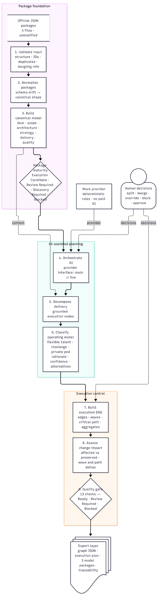

# Deal-to-Challenge Graph Engine

A browser-based planner and compiler for deal-scoping exports. It takes raw deal JSON or a ZIP of packages, normalizes them into a canonical model, validates references and assumptions, decomposes the work into delivery nodes, classifies the right operating model, and exports a deterministic execution-ready package.

This project is built for single-operator planning work. It does not recruit talent, approve budgets, or commit delivery timelines; it makes the work legible, reviewable, and exportable.

## What this project does

- Imports deal-scoping exports from pasted JSON, uploaded files, or ZIP archives
- Preserves the original source data and keeps a canonical, id-preserving model
- Validates structure, identifiers, references, platform conflicts, data freshness, and missing inputs
- Assesses maturity as Execution Candidate, Review Required, Discovery Required, or Blocked
- Decomposes the package into grounded delivery nodes with source anchors and provenance
- Classifies each node for Flexible Talent, Challenge, or Private Pod
- Builds a DAG with edges, dependencies, execution waves, critical path, and traceability
- Runs a deterministic quality gate and exposes every rule behind the decision
- Exports graph JSON, quality JSON, execution plans, per-node packages, and a ZIP bundle
- Records operator decisions, overrides, approvals, and AI suggestions in an append-only decision log

## Why it exists

The engine turns unstructured deal packages into something operationally usable:

- a transparent validation report
- a normalized execution model
- a classified project graph
- a reasoned quality decision
- exportable artefacts a delivery team can act on

The focus is not to guess. When the data is incomplete, the system marks it as missing or discovery-driven instead of fabricating a conclusion.

## Architecture overview



## Tech stack

- React + Vite for the browser UI
- TypeScript for the engine and the app
- Bun as the test and script runner
- Tailwind CSS for styling
- Pure TypeScript engine package with no React, DOM, or network dependency in the core logic

## Project structure

```text
.
├── docs/                          # Architecture and decision docs
├── packages/
│   └── engine/
│       ├── src/                  # Core compiler logic
│       │   ├── ai/               # AI provider interfaces and mock provider
│       │   ├── canonical/        # Canonical domain and execution types
│       │   ├── classify/         # Classification scoring
│       │   ├── dag/              # Graph, waves, edges, critical path
│       │   ├── decompose/        # Delivery-node generation
│       │   ├── decisions/        # Append-only decision log
│       │   ├── export/           # JSON/Markdown/ZIP exports
│       │   ├── ingest/           # Parsing, normalization, validation, ZIP handling
│       │   ├── impact/           # Change impact and deterministic recompile checks
│       │   ├── packages/         # Model-specific execution packages
│       │   ├── quality/          # Quality gate rules
│       │   ├── samples/          # Vendored example packages
│       │   ├── compile.ts        # Single entry point: compileDeal
│       │   └── index.ts          # Public engine exports
│       └── tests/                # Engine coverage and acceptance tests
├── public/                       # Static assets and fonts
├── scripts/                      # CLI scripts and validation helpers
├── src/                          # Browser app UI
│   ├── components/              # Reusable UI components
│   ├── pages/                   # Landing and workspace pages
│   ├── lib/                     # UI utilities
│   └── main.tsx                 # App bootstrap
├── samples/                      # Generated artifacts from sample runs
├── package.json                  # Root scripts and dependencies
├── bun.lock                     # Lock file
├── vite.config.ts               # Vite config
├── eslint.config.js             # ESLint config
├── tsconfig*.json               # TypeScript config
└── README.md                    # Project docs
```

## Getting started

### Prerequisites

- Node.js 20+ (or use the version managed by the repo tooling)
- Bun 1.4.2+ (the repo declares this in the root `package.json`)

### Install dependencies

```bash
bun install
```

### Start the app locally

```bash
bun run dev
```

Then open:

- http://localhost:5173 for the landing page
- http://localhost:5173/workspace for the planning workspace

## Useful commands

```bash
bun test                # Run the engine test suite
bun test --coverage     # Run tests with coverage output
bun run typecheck       # Type-check the TypeScript project
bun run lint            # Lint the app and engine code
bun run build           # Production bundle build
bun run samples         # Compile all sample packages and write output artifacts
bun run vendor-inputs   # Inline sample package JSON into the engine
bun run check-submission # Acceptance checks for import → classify → export → impact
```

## How the engine works

The project is built around one primary pipeline:

```text
raw JSON / ZIP input
  → parse and normalize
  → validate references and package quality
  → assess maturity
  → decompose into delivery nodes
  → classify node operating model
  → build DAG and execution waves
  → run quality gate
  → export graph, quality, plan, and package outputs
```

The key entry point is:

```ts
compileDeal(imported, { decisions })
```

This is a deterministic pipeline. When the same inputs and decisions are given, the output remains consistent. That property is what enables the change-impact system to prove precisely which nodes changed and which remain byte-for-byte identical.

## How to work on this project

### 1. Understand the input first

Most work starts with a deal-scoping JSON package or one of the bundled sample packages. Start by checking how the package is structured and what the expected model looks like. The most important place to inspect is the engine under `packages/engine/src/ingest/` and the canonical types under `packages/engine/src/canonical/`.

### 2. Change engine logic in the core package

The core compiler is intentionally isolated from the UI. If you are fixing logic around:

- validation rules: look in `packages/engine/src/ingest/`
- node decomposition: look in `packages/engine/src/decompose/`
- operating model scoring: look in `packages/engine/src/classify/`
- graph and dependency logic: look in `packages/engine/src/dag/`
- quality gate decisions: look in `packages/engine/src/quality/`
- output generation: look in `packages/engine/src/export/`

This is the main place to build features or fix bugs.

### 3. Keep the UI thin and declarative

The browser app in `src/` is mostly a presentation layer over the engine output. It reads compiled data and renders it in workspace panels and views.

If you need to change UI behavior, inspect:

- `src/pages/Landing.tsx` for the landing page
- `src/pages/Workspace.tsx` for the main planning workspace
- `src/components/workspace/` for the detail views, panels, and graphs

### 4. Validate with the smallest relevant command

Run the smallest command that checks the change you made:

```bash
bun test
bun run typecheck
bun run lint
```

For export or pipeline changes, also run:

```bash
bun run samples
bun run check-submission
```

### 5. Treat the engine as the source of truth

The app should reflect engine output, not replicate logic separately. If a rule belongs to the compiler, it should live in the engine package. That keeps the system deterministic and testable.

## Sample packages and output artifacts

The repo includes bundled sample deal packages used for validation and demonstration. They are intentionally designed to surface the edge cases the engine needs to handle, such as:

- unresolved references
- platform conflicts
- stale anchors
- missing capacity or seniority data
- discovery-heavy work
- unresolved dependency names

Generated outputs are written under `samples/` when you run:

```bash
bun run samples
```

## Working conventions

- Favor deterministic, explicit logic over AI-style guessing
- Preserve source identifiers and provenance whenever possible
- When data is missing, surface a gap instead of inventing a value
- Keep engine logic pure and testable
- Prefer one well-named pipeline function over scattered side effects
- Use the decision log to capture operator overrides and approvals

## Acceptance and quality bar

Before shipping a change, verify that:

- tests still pass
- TypeScript still type-checks
- the app still builds
- the compiled output is consistent with the expected pipeline behavior
- any user-visible behavior is reflected in the relevant workspace view

## Contributing

1. Make a focused change in the relevant engine or UI area
2. Add or update tests for behavior changes
3. Run the project checks
4. Keep the patch small and scoped to the underlying issue

## Notes

- The tool is intentionally offline and single-operator by design
- AI suggestions are explicit and labelled; they are not silently applied
- The production workflow is deterministic and exportable, which makes it suitable for audited planning and review rather than ad hoc guessing

This repo is a full compiler pipeline, not a mock. The engine is the real source of truth; the UI is the interface that makes it inspectable and usable.
