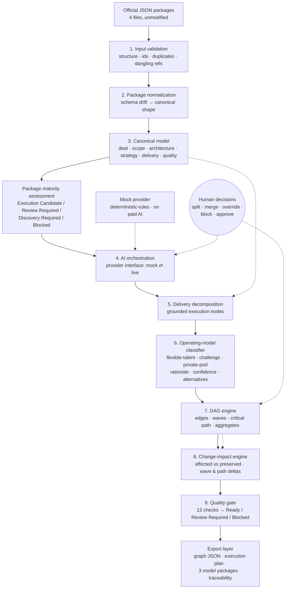

# Submission Architecture

The nine components the challenge asks the diagram to show, in the order data
flows through them, plus the human-decision path that feeds back in.

## Diagram



## Component notes

- **Input validation** (`ingest/validate.ts`) reports structure, duplicate and
  dangling identifiers, stale sections and conflicts. It never throws away the
  original: the imported package is preserved separately from the normalized
  model, as the spec requires.
- **Normalization** (`ingest/normalize.ts`) maps the workspace-export shape onto
  the canonical model, preserving every source id. Mapping rules are documented
  in [source-to-canonical-mapping.md](./source-to-canonical-mapping.md).
- **AI orchestration** (`ai/`) is a provider interface. The mock provider is
  deterministic rules, so the complete workflow for all four packages runs with
  no paid access.
- **Decomposition and classification** (`decompose/`, `classify/`) produce
  grounded nodes with exactly one primary model, a plain-language rationale,
  confidence, alternatives and override history.
- **DAG engine** (`dag/`) derives edges, waves, critical path and aggregates as
  a pure function of nodes + package + revision, so recompiling after an edit
  reproduces untouched nodes byte-for-byte.
- **Change impact** (`diffGraphs`) and the **quality gate** (`validate`) run
  after every edit; operator decisions are part of the input, never discarded.
- **Export** writes machine-readable graph JSON, a human-readable plan, the
  three model-specific packages and the traceability matrix.

## Package layout

```
packages/engine   all deterministic logic + mock AI (96% covered by tests)
src/              React workspace UI (6 sections)
samples/          the four official packages + generated sample outputs
scripts/          check-submission, sample generation, submission checks
docs/             this file, gap analysis, mapping rules, decisions
```
